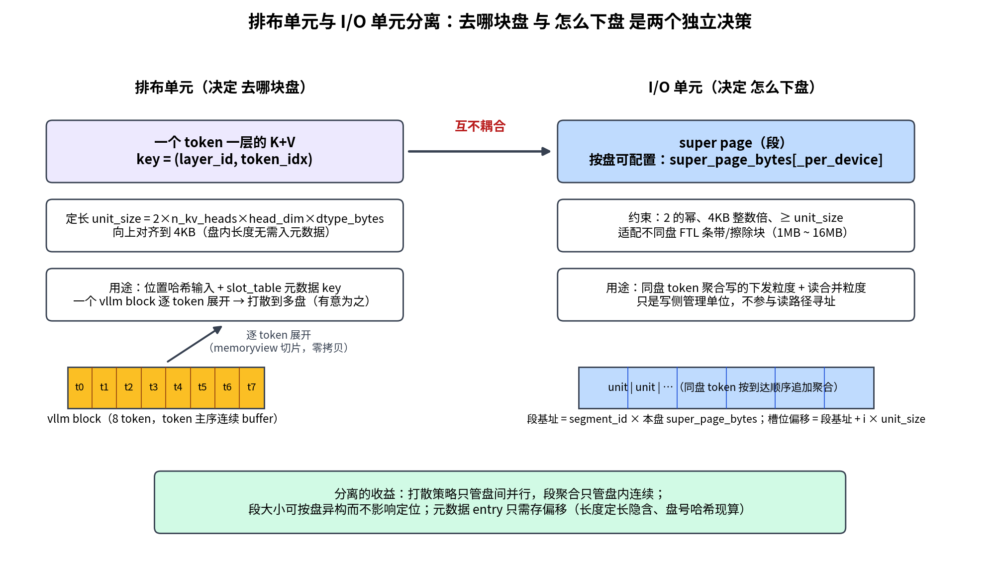
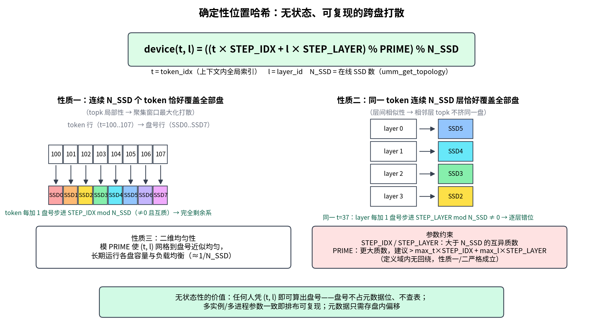
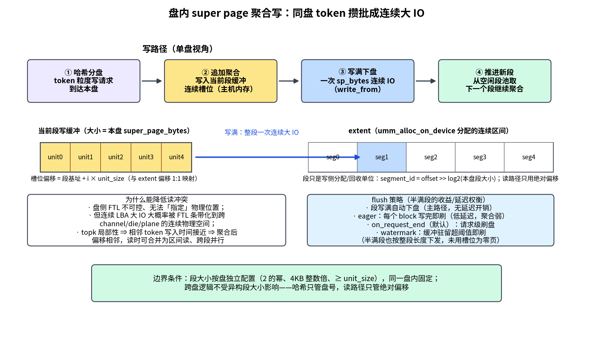
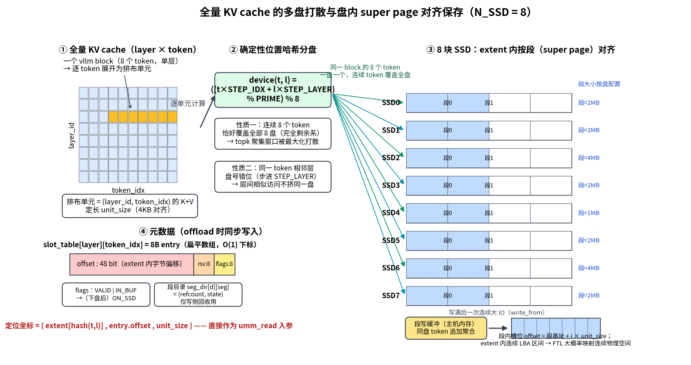
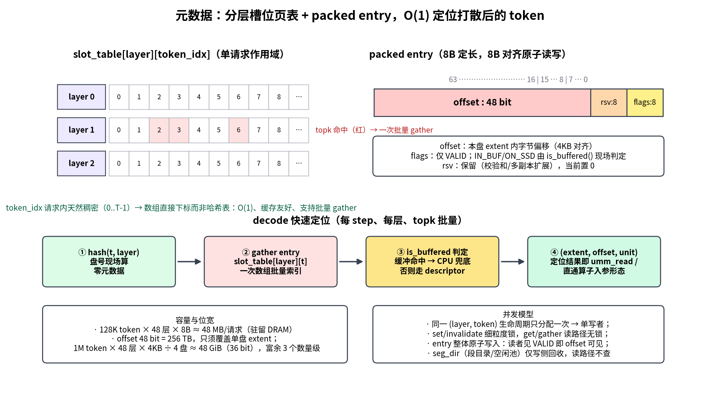
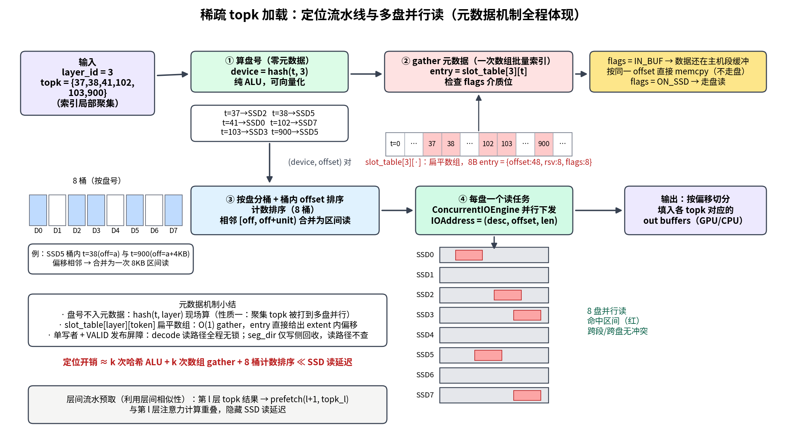

# 06 稀疏注意力 KV Cache 多 SSD 卸载——数据排布优化设计

> 面向稀疏注意力（topk 选择）LLM 推理场景的 KV cache 卸载方案。
> 核心思想：**排布单元与 I/O 单元分离**——用确定性位置哈希在 token 粒度决定
> "去哪块盘"，用 super page 粒度的聚合写在盘内决定"怎么下盘"（段大小按盘
> 可配置，适配不同规格 SSD），用分层槽位页表（地址+偏移量）在 decode 阶段
> O(1) 定位 topk 单元。纯主机侧排布优化，不修改盘侧（FTL 不可控）。
>
> 注意：本文描述排布与元数据机制的最终形态；读路径执行形态已由
> `07_VirtualMedia合并设计_稀疏KV专用介质.md` 确定为——本项目只提供
> 卸载接口并输出地址映射表（descriptor buffer），加载由 GPU 直通算子在
> 图内执行；CPU 侧 `fetch` 仅作联调/兜底。元数据 flags 已简化为仅保留
> `VALID`，IN_BUF/ON_SSD 判定下沉到介质层 `VirtualMedia.is_buffered()`。

## 1. 背景与问题

稀疏注意力推理中，每个 decode step 只对 topk 选中的少量历史 token 计算
注意力。把全量 KV cache 卸载到多 SSD 后，性能瓶颈从"容量"转为"读路径"：

- topk 选中的 token 索引具有**局部性**（聚集在某些区间）；
- 相邻层的 topk 集合具有**层间相似性**（高度重合）；
- 朴素排布（如 round-robin 按写入顺序）下，一次 topk 加载容易在多块盘上
  形成离散小 IO，落在盘内相同 channel/die/plane 上排队，产生**读冲突**；
- decode 每 step、每层都要定位 topk 单元，**定位元数据必须极快**，
  否则元数据开销会吃掉打散带来的并行收益。

本方案针对这四点设计数据排布与元数据结构，目标是：

1. topk 批量读天然打成全盘并行（跨盘打散适配局部性与层间相似性）；
2. 盘内把同盘 token 粒度的离散小写聚合起来，以 super page 粒度下发连续
   写请求，使其落在连续 LBA 区间（经 FTL 条带化后大概率对应连续物理
   空间），降低 topk 读冲突；
3. 接口直接接收 vllm 管理的 KV block 信息，全量 KV cache 统一排布；
4. decode 阶段定位 topk KV 的元数据开销可忽略（O(1) 数组下标 + 批量流水），
   且定位结果直接就是 UMM 数据面的"地址+偏移量"，无需二次翻译。

## 2. 数据模型：排布单元与 I/O 单元分离

| 概念 | 粒度 | 作用 |
|---|---|---|
| 排布单元 | `(layer_id, token_idx)` 一个 token 一层的 K+V | 决定"去哪块盘"（哈希输入、元数据 key） |
| I/O 单元 | super page（**按盘可配置**，默认 2MB） | 决定"怎么下盘"（聚合写 / 合并读的下发粒度） |

- **排布单元定长**：`unit_size = 2(K,V) × n_kv_heads × head_dim × dtype_bytes`，
  向上对齐到 4KB。定长使每个单元的盘内长度无需入元数据，entry 只需记
  起始偏移。
- **vllm block 只是批量输入容器**：vllm 以 block（如 16 token）管理 KV，
  本方案在接口处把 block 逐 token 展开为排布单元。一个 block 的 token
  会被打散到多块盘——这是有意的：topk 窗口内相邻 token 本就要分盘。



## 3. 确定性位置哈希（跨盘打散）

```
device(t, l) = ((t * STEP_IDX + l * STEP_LAYER) % PRIME) % N_SSD
```

- `t`：token 在上下文序列中的全局索引 `token_idx`
- `l`：模型层编号 `layer_id`
- `N_SSD`：在线 SSD 数量（≤ 16，运行时取 `umm_get_topology()`）
- `STEP_IDX`、`STEP_LAYER`：大于 N_SSD 的互异质数
- `PRIME`：更大的质数（选取规则见 §3.2）

### 3.1 性质推导：为什么适配稀疏注意力

**性质一：topk 局部性 → 连续 token 覆盖全盘。**
固定 `l`，`t` 每加 1，盘号步进 `STEP_IDX mod N_SSD`。因为 `STEP_IDX`
是大于 N_SSD 的质数，有 `gcd(STEP_IDX, N_SSD) = 1`，步进值非零且与
N_SSD 互质，所以 **任意连续 N_SSD 个 token 恰好落在 N_SSD 块不同的盘上
（构成模 N_SSD 的完全剩余系）**。topk 选中的 token 索引是局部聚集的，
聚集窗口被最大化打散，一次 topk 批量读天然变成 N_SSD 块盘的并行读。

**性质二：层间相似性 → 同 token 相邻层错位。**
固定 `t`，`l` 每加 1，盘号步进 `STEP_LAYER mod N_SSD ≠ 0`。稀疏注意力
相邻层 topk 集合高度重合，逐层加载同一 token 的多层 KV 时，请求被分散到
不同盘，不会出现"所有层的热门 token 集中打满同一块盘"。

**性质三：二维均匀性。**
模 PRIME 使 `(t, l)` 二维网格到盘号的映射近似均匀，长期运行各盘容量与
负载均衡（大样本下每盘分得约 `1/N_SSD` 的单元）。



### 3.2 参数选取规则

- `STEP_IDX ≠ STEP_LAYER`，均为大于 N_SSD 的质数（质数 > N_SSD 自动满足
  与 N_SSD 互质，性质一、二成立）。
- `PRIME`：建议取大于 `max_token_idx × STEP_IDX + max_layer_id × STEP_LAYER`
  的最小质数。此时定义域内无取模回绕，哈希退化为精确线性组合，§3.1 的
  性质可严格成立；受限于 64 位整数范围时可放宽为远大于 N_SSD 的质数，
  均匀性仍保持。
- 默认值建议（N_SSD=4、128K 上下文、48 层模型）：

| 参数 | 默认值 | 说明 |
|---|---|---|
| `STEP_IDX` | 17 | > N_SSD 的质数 |
| `STEP_LAYER` | 23 | > N_SSD 且 ≠ STEP_IDX 的质数 |
| `PRIME` | 按部署计算（示例：需 > 131071×17 + 47×23 = 2,229,288，取其后最小质数） | 按实际 max_token/max_layer 计算 |
| `super_page_bytes` | 2 MiB（全局默认，可按盘覆盖） | 每盘独立配置，须为 2 的幂且为 4KB 整数倍，见 §4 |
| `unit_size` | 按模型配置推导，4KB 对齐 | 见 §2 |

> 注：PRIME 的精确取值在实现时按部署模型的 max context 与层数计算并写入
> 配置；上表仅示意数量级。

### 3.3 无状态性的价值

任何人凭 `(t, l)` 即可算出盘号，**读路径"数据在哪块盘"零元数据**：

- 盘号不占元数据位、不查表；decode 定位只需哈希 ALU 运算；
- 元数据只保留盘内偏移量（§5），容量与查表开销最小化；
- 多实例/多进程只要参数一致，对同一 `(t, l)` 得到相同盘号，排布可复现。

## 4. 盘内 super page 聚合写（关键机制）

### 4.1 前提与边界：我们能做什么、不能做什么

- 盘侧 FTL 不可控，本方案不做任何盘侧修改，也**无法向 SSD"指定"按
  super page 写入或指定物理位置**。UMM 数据面暴露的盘侧空间就是
  **extent（chunk 基址）+ 偏移量**的字节区间，这是我们唯一能控制的寻址方式。
- 我们能做的：把哈希到同一盘的多个 token 粒度 KV 先在主机侧聚合，
  **以 super page 粒度作为一次连续写请求下发**（`UMMLib.write_from` 写
  extent 内一段连续偏移区间）。这段区间在 LBA 上连续，利用的经验性质是
  **连续 LBA 大 IO 大概率被 FTL 条带化映射到跨 channel/die/plane 的连续
  物理空间**，读连续区间可调动多 channel 并行；离散小 IO 则容易在同一
  die/plane 上排队冲突。
- 因此 super page 在本方案中**只是写聚合与 IO 下发的粒度，不是可寻址
  单元**；元数据里不出现"super page 号"，定位一律用偏移量（§5）。

### 4.2 段大小按盘可配置（适配不同规格 SSD）

不同型号 SSD 的 FTL 条带宽度、擦除块大小不同，最优聚合粒度也不同
（如 SATA 盘 1MB、企业级 NVMe 2–4MB、大容量 QLC 盘 4–16MB）。因此：

- **段（segment）大小按盘独立配置**：配置项
  `super_page_bytes`（全局默认）+ `super_page_bytes_per_device`（按盘覆盖，
  见 §6）。约束：每盘的段大小必须是 **2 的幂**且为 4KB 整数倍、
  ≥ `unit_size`（保证每段至少装一个单元，且段内偏移可用移位计算）。
- 同一盘内段大小固定；不同盘之间可以不同——这不影响任何跨盘逻辑：
  哈希只决定盘号，读路径只用绝对偏移（§5.2），**段大小只在写侧分配与
  回收时、在单盘上下文内使用**。
- 每块 SSD 通过 `umm_alloc_on_device` 分配一个连续 extent，按本盘段大小
  逻辑划分为段。段只是写侧分配与回收的管理单位，不参与读路径寻址：
  `segment_id = offset >> log2(super_page_bytes[device])`。

### 4.3 聚合写路径

- 每盘维护一个"当前段"内存写缓冲（大小 = 本盘段大小）：
  1. offload 的 block 逐 token 展开，经哈希分盘后，落到同一盘的 token
     粒度写请求按到达顺序**追加聚合**到该盘当前段缓冲的连续位置；
  2. 缓冲写满后，作为**一次段大小的连续 IO** 写入 extent 中该段对应的
     连续偏移区间（段基址 = segment_id × super_page_bytes[device]）；
  3. 推进到本盘下一个空闲段，重复。
- 效果：同一次写请求覆盖的所有 token KV 落在连续 LBA 区间，大概率对应
  盘侧连续物理空间；聚合缓冲区本身同时充当"未落盘数据的读缓存"（§5.3）。





上图总览写路径全链路：① 全量 KV cache（layer × token 网格）按 vllm block
逐 token 展开为排布单元；② 位置哈希把同一 block 的连续 token 恰好打散到
全部 8 盘（完全剩余系），同 token 相邻层错位；③ 每盘 extent 内按各自配置
的段（super page）大小对齐，同盘单元先聚合进段写缓冲、写满后一次连续大 IO
下盘；④ offload 时同步写 slot_table（8B entry：offset:48 + rsv:8 +
flags:8），定位坐标 `(extent[hash(t,l)], entry.offset, unit_size)` 直接
就是 `umm_read` 入参。

### 4.4 读冲突如何降低

- **区间合并**：topk 局部性意味着被选 token 的写入时间接近，经聚合后倾向
  落在同一下盘区间（偏移相邻）；读路径把偏移相邻的目标合并为一次区间读。
- **跨段并行**：不同段对应的连续 LBA 区间物理上大概率分属不同 die/plane
  组，可并发读不冲突。读冲突从"离散小 IO 随机打架"降为"段级并行"。

### 4.5 flush 策略

- 段缓冲写满自动下盘（主路径，无延迟开销）。
- 半满段由 `flush()` 强制下盘：请求结束、prefill→decode 切换、或配置
  的超时/水位触发。半满段是聚合收益与落盘延迟的 trade-off，策略可配置：
  - `eager`：每个 block 写完即刷（低延迟，聚合弱）；
  - `on_request_end`（默认）：请求级刷盘；
  - `watermark`：缓冲驻留超过阈值即刷。

## 5. 高性能元数据结构：分层槽位页表（Slot Table）

decode 阶段每 step、每层要对 topk 集合（数十到数百个 token_idx）逐个完成
`(layer_id, token_idx) → 盘内偏移量` 的定位。该路径延迟敏感、批量、
读多写少（offload 时每个单元写一次，decode 反复读）。盘号不入元数据
（§3.3），元数据只记盘内偏移；定位结果 `（extent, offset, unit_size）`
**直接就是 UMM 数据面 `umm_read` 的入参形态，零二次翻译**。

### 5.1 主体结构：分层扁平数组（类比 vllm block table）

- 按 `(request, layer)` 组织的扁平数组：
  `slot_table[layer][token_idx] -> packed entry`。
- token_idx 在请求内天然稠密（0..T-1），用**数组直接索引而非哈希表**：
  O(1) 一次下标、缓存友好、支持批量 gather，无哈希冲突与指针跳转。

### 5.2 packed entry（8B，定长无锁读）

```
 63                16 15       8 7      0
+--------------------+-----------+--------+
|   offset : 48 bit  | rsv : 8   | flags:8|
+--------------------+-----------+--------+
```

- `offset`：单元在**本盘 extent 内的字节偏移**（4KB 对齐）。盘号由哈希
  算出、长度由定长 `unit_size` 隐含，因此读地址三元组
  `(extent[hash(t,l)], offset, unit_size)` 无需任何额外元数据。
  - 单元尚未下盘时（仍在主机聚合写缓冲），该偏移同时是缓冲内的位置
    （段缓冲按 extent 偏移 1:1 映射，见 §4.3），内存读与盘读用同一套坐标。
  - entry 与段大小**解耦**：读路径只用绝对偏移，从不依赖段尺寸；
    段大小仅写侧使用（§4.2），这正是段大小可按盘异构配置的前提。
- `rsv`：保留位（可用于校验和、多副本等扩展；当前置 0）。
- `flags`：仅 `VALID`（entry 已分配有效）。IN_BUF/ON_SSD 不再占用
  flags 位，而是由介质层 `VirtualMedia.is_buffered(device, offset)` 在
  地址规划（plan）时现场判定——段缓冲按 extent 偏移 1:1 映射，无需在
  entry 中冗余介质状态。

**容量估算**：128K token × 48 层 × 8B ≈ **48 MB/请求**（只对实际卸载的
层建表可再减）。驻留主机 DRAM，量级与 vllm block table 一致，可接受。

**offset 48 bit 对 1M 上下文是否够用**：offset 只需覆盖**单盘 extent**，
其上界本质是单盘容量，而非 KV 总量。按最大部署估算：

```
单盘最大偏移需求 = ceil(max_tokens × n_layers × unit_size / N_SSD)
```

| 场景 | 单盘需求 | 所需位数 |
|---|---|---|
| 1M token × 48 层 × 4KB 单元 ÷ 4 盘 | ≈ 48 GiB | 36 bit |
| 1M token × 126 层 × 4KB 单元 ÷ 4 盘 | ≈ 126 GiB | 37 bit |
| 1M token × 80 层 × 8KB 单元 ÷ 2 盘（偏大单元极端） | ≈ 320 GiB | 39 bit |

48 bit = 256 TB 寻址，对 1M 上下文的实际需求富余约 3 个数量级；即使单盘
顶到现有企业级 SSD 容量上限（~61 TB，需 46 bit）也够用。**结论：48 bit
对 1M 序列长度完全足够**，瓶颈永远在单盘物理容量而不是寻址位宽。未来若
单盘超过 256 TB，可把 offset 改为以 4KB 为单位存储（等效 60 bit），
entry 宽度与流水线不变。



### 5.3 decode 批量定位流水线（关键路径）

输入 `layer_id + topk_indices[]`；输出是供 GPU 直通算子消费的
**descriptor buffer**（生产读路径），CPU `fetch` 仅为联调/兜底形态
（执行形态契约见 `07_…md` §5）：

1. **算盘号**：对每个 `t` 并行计算 `hash(t, layer_id)`——纯 ALU，
   可向量化/多线程，零元数据。
2. **gather entry**：`entry = slot_table[layer_id][t]`，一次批量 gather；
   校验 `VALID`，取 extent 内偏移。
3. **IN_BUF 兜底判定**：`VirtualMedia.is_buffered(device, offset)` 现场判定
   单元是否仍在主机段聚合缓冲；命中的由 CPU 直接 memcpy 到 staging
   对应 `dst_offset`，entry 标记 `HOST_READY`，GPU 算子跳过该条 IO。
4. **组装 descriptor**：按 `entry[i] = {ssd_id, flags, lba_offset,
   length, dst_offset}` 写入固定地址 buffer，其中
   `lba_offset = extent_base(ssd_id) + offset`、`length = unit_size`、
   `dst_offset = i * unit_size`。
5. **CPU 兜底 fetch（非生产路径）**：无 GPU 直通硬件时，按盘分桶、
   桶内 offset 排序、相邻偏移合并为区间读，经 `ConcurrentIOEngine`
   跨盘并行执行——该路径用于验证排布正确性。

定位 topk 的总开销 ≈ k 次哈希 ALU + k 次数组 gather + descriptor 打包，
相对 SSD 读延迟可忽略；全链路无锁只读。



上图以 `layer_id=3, topk={37,38,41,102,103,900}` 为例走完整条读路径，
元数据机制全程体现：① 盘号由哈希现场计算（零元数据），聚集的 topk 索引
被打到多盘；② 对 slot_table 第 3 层扁平数组做一次批量 gather，8B entry
直接给出 extent 内偏移（flags 只有 VALID；IN_BUF/ON_SSD 由
`is_buffered` 现场判定）；③ 生产路径把结果打包成 descriptor buffer 交给
GPU 直通算子并行读，兜底路径按盘分桶、相邻偏移合并为区间读；
④ 每盘读任务经 ConcurrentIOEngine 并行下发，跨段/跨盘无冲突。
seg_dir 仅写侧回收使用，读路径不查。

### 5.4 写路径更新：单写者 + flags 发布

- 同一 `(layer_id, token_idx)` 在整个生命周期只被分配一次 ⇒ slot_table
  是**单写者**结构，写路径（set/invalidate）由细粒度锁串行化，读路径
  （get/gather）无锁。
- offload 时单元追加进段缓冲即写 `slot_table[l][t] = pack(offset, VALID)`；
  **介质位不再入 entry**——单元是否已下盘由 `VirtualMedia.is_buffered()`
  现场判定，段 flush 时无需批量翻转 flags。
- 与 decode 读者之间的发布顺序：entry 是一次性整体写入的 8B 原子 int，
  读者见 `VALID` 即保证 offset 字段可见。

### 5.5 辅助结构与回收（仅写侧，不进读路径）

- **段目录**：每盘一个按 segment_id 下标的小数组
  `seg_dir[device][segment_id] -> (refcount, state)`，段数 =
  extent 大小 ÷ 本盘段大小（因盘而异）。段基址由 segment_id 与本盘段大小
  反算，无需存储；读路径通过
  `entry.offset >> log2(super_page_bytes[device])` 可随时推出所属段，
  **不需要为读查目录**。
- **空闲段池**：每盘一个空闲 segment_id 栈，分配/回收 O(1)。
- **段级回收**：vllm block 释放 → `release()` 置对应 entry invalid，
  并按 `offset` 推出所属段递减 refcount；归零段整块回空闲池。
  **无段内整理/压缩**——KV 生命周期与请求一致，同请求 token 的淘汰时间
  接近，同段单元倾向同期失效，段级回收空洞率可控（仿真验证，见 §8）。
- **请求生命周期**：请求结束批量释放该请求各层 slot_table 行 + 相关段
  引用，支持按请求/按前缀段整块失效。

### 5.6 备选结构与取舍

| 结构 | 优势 | 劣势 | 结论 |
|---|---|---|---|
| 哈希表 `dict[(l,t)]->offset` | O(1)、稀疏友好 | 随机访问、每 entry 百倍内存开销，decode 批量查询缓存不友好 | 弃用 |
| 基数树 / ART | 稀疏 key 省内存 | 此处 key 天然稠密，无收益；多级指针跳转 | 弃用 |
| 存 (super_page_id, slot) 的间接寻址 | 页号短 | super page 不是 UMM 可寻址单元，读路径还需查目录二次翻译成偏移；且段大小按盘异构时间接寻址更绕 | 弃用 |
| **分层扁平数组 + 直接偏移** | O(1) 下标、缓存友好、定位结果即 umm_read 入参、与段大小解耦、单写者无锁 | 内存按 max_len 预留（48MB/请求可接受） | **采用** |

## 6. 接口设计（vllm 集成）

合并重构后分为两层：`VirtualMedia`（介质层）与 `SparseKVStore`
（框架对接层）。最终形态详见
`07_VirtualMedia合并设计_稀疏KV专用介质.md`。

```python
@dataclass
class KVBlockRef:
    """vllm 管理的 KV block 信息（CPU 侧）。"""
    layer_id: int
    block_idx: int           # vllm block table 中的块号（透传，不参与排布）
    token_start: int         # block 内首个 token 的全局 token_idx
    token_count: int         # 通常 = vllm block_size
    buffer: memoryview       # 该 block 的 K/V 数据（token 主序连续排布）

class VirtualMedia:
    """介质层：盘感知 + 打散策略 + 段聚合写路径。"""
    def write(self, key, data: bytes) -> int: ...   # 返回 extent 内偏移
    def flush(self) -> None: ...
    def release(self, device: int, offset: int) -> None: ...
    def is_buffered(self, device: int, offset: int) -> bool: ...

class SparseKVStore:
    """框架对接层：KV block 语义 + slot_table + 地址规划。"""
    def offload(self, blocks: list[KVBlockRef]) -> None:
        """逐 token 展开 → vm.write 按策略分盘聚合 → slot_table 记偏移。"""

    def plan(self, layer_id: int, token_indices: list[int]) -> PlanView:
        """topk 地址规划：§5.3 流水线，产出固定地址 descriptor buffer，
        供 GPU 直通算子在图内加载；本项目不执行生产读 IO。"""

    def fetch(self, layer_id: int, token_indices: list[int],
              out: list[memoryview]) -> None:
        """CPU 兜底批量读（联调/无直通硬件用）。"""

    def release(self, layer_id: int, token_indices: list[int]) -> None:
        """批量失效：entry 置 invalid + 递减所属段引用计数。"""

    def flush(self) -> None:
        """强制刷所有盘的半满段缓冲。"""
```

> 当前参考实现（`bmpclient/virtual_media.py` + `bmpclient/sparse_kv/store.py`）
> 为同步接口；生产集成时可在其上包一层 IOHandle 异步句柄，接口语义不变。

- vllm 适配层（`vllm_adapter`）负责把 vllm block table + KV tensor 视图
  翻译为 `KVBlockRef` 列表；block 内 token 主序连续排布使展开只是
  memoryview 切片，零拷贝。
- 配置 `bmpclient/config/virtual_media.json`（原 `config/sparse_kv.json`
  已合并废弃）：

```json
{
  "strategy": "position_hash",
  "step_idx": 17,
  "step_layer": 23,
  "prime": 2229299,
  "super_page_bytes": 2097152,
  "super_page_bytes_per_device": { "0": 4194304, "2": 1048576 },
  "flush_policy": "on_request_end",
  "max_topk": 512
}
```

  其中 `super_page_bytes` 是全局默认，`super_page_bytes_per_device` 按盘
  覆盖（键为 SSD 设备索引），每个取值必须是 2 的幂、4KB 整数倍且
  ≥ unit_size；`N_SSD` 运行时从 `umm_get_topology()` 取，不落盘配置；
  `max_topk` 由调用方传入 `SparseKVStore` 构造函数（descriptor buffer
  预留长度），建议与配置中的 `max_topk` 保持一致。
- 排布参数（STEP/PRIME/N_SSD/各盘段大小）变更 = 全量重排，只允许在服务
  启动时确定，运行期不可变（文档级约束）。

## 7. 与现有代码的对接

- **复用**：`UMMLib.alloc_on_device`（每盘 extent）、`UMMLib.write_from /
  read_into`（零拷贝 IO，入参正是 desc+offset，与元数据定位结果同构）、
  `ConcurrentIOEngine`（CPU 兜底读的并行读写、IOHandle）、
  `umm_get_topology`（在线盘数）、`FakeUMMLib`（单测）。
- **合并后的模块布局**（单测 `tests/test_virtual_media.py` /
  `tests/test_sparse_kv.py`）：
  - `bmpclient/virtual_media_strategy.py`：`PlacementStrategy` 抽象 +
    `PositionHashStrategy`（位置哈希 + 参数校验）；
  - `bmpclient/_vm_segment.py`：盘内段分配器（按盘段大小、空闲池 +
    引用计数）与聚合写缓冲（介质层私有模块）；
  - `bmpclient/virtual_media.py`：`VirtualMedia` 介质层主类；
  - `bmpclient/virtual_media_config.py` / `config/virtual_media.json`：
    合并后的配置加载；
  - `bmpclient/sparse_kv/slot_table.py`：分层槽位页表（packed entry、
    批量 gather、flags 仅 VALID）；
  - `bmpclient/sparse_kv/store.py`：`SparseKVStore` 框架对接层
    （offload/plan/fetch/release/flush/prefetch）；
  - `bmpclient/sparse_kv/vllm_adapter.py`：`KVBlockRef` 与 block table 翻译。
- **合并前后对比**：

| 维度 | 旧 VirtualMedia（已删除） | 新栈：VirtualMedia + SparseKVStore |
|---|---|---|
| 打散依据 | 全局自增索引（无语义） | `(token_idx, layer_id)` 语义哈希 |
| 盘号计算 | 策略函数 + 写入顺序 | 纯哈希、无状态、可复现 |
| 盘内排布 | 槽位顺序填充、逐条 IO | 段缓冲聚合、按盘配置的连续大 IO |
| 读取定位 | 全量 `_index_map` 线性表 | 分层槽位页表 O(1) 下标，entry 直接存偏移 |
| 读路径执行 | CPU `read()` | 生产：GPU 直通算子按 descriptor buffer 加载；CPU `fetch` 仅兜底 |
| 负载语义 | 通用定长存储 | 稀疏注意力 topk 读优化 |

- **指定盘分配已恢复**：`umm_alloc_on_device` 的 direct/RPC 路径与每盘拓扑
  已接通；可使用真实 libumm 和文件后端验证 VirtualMedia/SparseKVStore。
  编译兼容性与测试命令见 [08_指定SSD分配接口.md](08_指定SSD分配接口.md)。
  NPU 直通所需的 `extent_base()` 盘侧地址导出仍为后续工作。

## 8. 验证方案

### 8.1 哈希性质单测（纯函数，无依赖）

- 确定性：同一 `(t, l)` 多次计算结果一致；
- 性质一：任意起点连续 N_SSD 个 token 覆盖全部 N_SSD 盘；
- 性质二：同一 token 连续 N_SSD 层覆盖全部 N_SSD 盘；
- 均匀性：大样本 `(t, l)` 网格分盘计数偏差在统计容差内。

### 8.2 排布行为单测（FakeUMMLib）

- 聚合写：N 个单元写满一个段只产生 1 次盘 IO，且写入偏移区间连续；
- 按盘段大小：不同盘配置不同段大小（如 1MB/2MB/4MB）时，各盘聚合写、
  读合并、段回收互不串扰，偏移坐标始终一致；
- 读合并：同盘偏移相邻的多目标合并为单次区间读；
- 回收：引用计数归零的段重新进入空闲池并被复用；
- 边界：满盘报错、flush 后半满段可读、unit_size 对齐校验。

### 8.3 元数据结构单测

- 定位正确性：offload 后 `fetch` 逐单元读回数据与写入一致；
  `plan()` 输出的 descriptor buffer 中 `(ssd_id, lba_offset)` 与
  slot_table entry 及位置哈希交叉一致（`tests/test_sparse_kv.py`）；
- 批量 gather：`slot_table.gather` 按层批量取 entry 正确；
- flags：仅 `VALID` 置位/清零（invalidate）语义正确；
- IN_BUF 兜底：未 flush 时 `plan()` 产出 `HOST_READY` entry 且 staging
  已回填数据；flush 后同一 token 产出 `DISK` entry；
- 并发：单写者 offload 与 decode 只读定位并发正确性（entry 原子发布）；
- 寻址核验：1M token × 目标层数的最大偏移不越 48 bit（§5.2 公式单测化）。

### 8.4 仿真对比（scripts）

构造稀疏 topk trace（token 索引局部聚集 + 相邻层集合高重合），对比
round-robin 基线，输出：每盘 IO 次数分布、topk 批量读的盘并行度、
偏移相邻合并率、段空洞率、decode 定位耗时分解。

## 9. 限制与后续

- 排布参数运行期不可变；扩容加盘（N_SSD 变化）需全量重排，属后续课题。
- 各盘段大小与真实盘 FTL 条带参数的匹配是经验调优项（连续 LBA → 连续
  物理只是大概率成立，非保证），真机阶段按盘型号 benchmark 后写入
  `super_page_bytes_per_device`（参考 `真机风险分析与测试流程.md` 流程）。
- 半满段延迟与聚合收益的 trade-off 由 `flush_policy` 暴露给上层调度。
- slot_table 按 max context 预留内存；超长上下文场景可改为分段
  （segment）按需分配，接口不变，属实现期优化。
