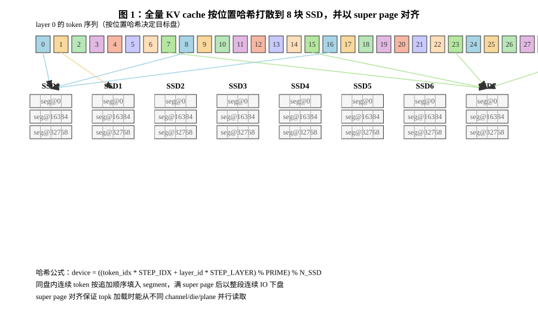
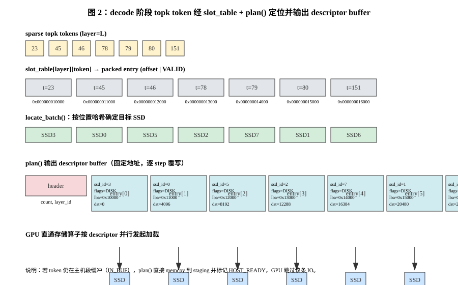

# 07 VirtualMedia 合并设计——稀疏 KV 专用介质（含 GPU 直通加载契约）

> 本文档定义两件事的最终形态：
> 1. `virtual_media*` 与 `sparse_kv/` 合并为统一介质层 **VirtualMedia**，
>    只服务于稀疏注意力 KV cache 卸载/加载场景；
> 2. 读路径架构：本项目**只提供卸载（写）接口**，加载不在本项目执行——
>    sparse_kv 返回 **token KV → 存储侧（设备地址, 偏移量）的映射信息**，
>    由 GPU 直通存储算子按映射在**图内**发起加载。
>
> 排布原理（位置哈希、段聚合写、slot table）见
> `06_稀疏注意力KV卸载数据排布设计.md`，本文不重复。

## 1. 合并动机与分工

现有两套实现共用同一 UMM 基座但各自演进：VirtualMedia 有盘感知与
可插拔策略框架但无语义排布，sparse_kv 有完整的位置哈希/段聚合/slot
table 但是独立介质。合并后按职责切分为两层：

```
推理框架（vllm / sglang，decode 图为 CUDA/ACL Graph）
   │  写：KVBlockRef          读：topk token_indices → 地址映射表
   ▼
sparse_kv 对接层（SparseKVStore）—— 只管"框架语义"
   · KVBlockRef 逐 token 展开（零拷贝切片）
   · slot_table 元数据：(layer, token) -> extent 内偏移
   · 地址规划 plan()：把 (layer, topk) 翻译成存储侧地址映射表
   · prefetch 缓存、release 失效、请求生命周期
   │  write(key, bytes)->offset / release / flush / is_buffered
   ▼
VirtualMedia（介质层，合并后）—— 只管"盘与数据路径"
   · 盘感知：umm_get_topology、alloc_on_device、extent 管理
   · 打散策略：可插拔 Placement 框架（position_hash 内建）
   · 写数据路径：段（super page）聚合写、连续大 IO 下盘、
     段引用计数回收、flush 策略
   ▼
UMMLib → libumm → SSD
```

**一句话分工**：sparse_kv 对接推理框架、管理 (layer, token) 语义与
地址映射输出；VirtualMedia 感知盘、执行打散策略、完成写的数据路径。

## 2. 读写路径的总体分工（关键架构决策）

| 路径 | 性能要求 | 执行者 | 是否入图 |
|---|---|---|---|
| 卸载（写） | 低（异步、可攒批） | **本项目 CPU 接口**，按打散策略写多盘、段聚合下盘 | 不入图 |
| 加载（读） | 高（decode 关键路径） | **GPU 直通存储算子**，按本项目返回的地址映射发起 | **入图** |

- 写路径保持本项目现有实现：CPU 提交、段聚合、连续大 IO，不需要
  GPU 参与，不入图。
- 读路径本项目**不执行任何 IO**，只输出地址映射。GPU 直通算子
  （NDS / GPUDirect 类）与本项目之间的契约只有一块**地址描述符
  buffer 的内存布局**（§5）。

## 3. VirtualMedia（介质层）接口

```python
class VirtualMedia:
    """稀疏 KV 场景专用介质：盘感知 + 打散策略 + 段聚合写路径。"""

    def __init__(
        self,
        lib: UMMLib,
        unit_size: int,                     # 排布单元定长（4KB 对齐）
        capacity_per_device: int,           # 每盘 extent 字节数
        strategy: str | PlacementStrategy | None = None,  # 见 §4
        sp_bytes: int = 2 * 1024 * 1024,    # 段（super page）全局默认
        sp_bytes_per_device: dict[int, int] | None = None,  # 按盘覆盖
    ): ...

    # ---- 打散策略（key -> device；稀疏 KV 场景 key = (layer_id, token_idx)）----
    def locate(self, key) -> int: ...
    def locate_batch(self, keys: list) -> list[int]: ...

    # ---- 写路径（CPU 提交，不入图）----
    def write(self, key, data: bytes) -> int:
        """locate(key) 分盘 → 追加该盘段缓冲（满则一次段大小连续 IO 下盘）。
        返回 extent 内字节偏移（调用方入 slot_table）。"""
    def flush(self) -> None:
        """强制刷所有盘的半满段缓冲。"""

    # ---- 读路径支撑（不执行读，只供地址规划与兜底）----
    def extent_base(self, device: int) -> int:
        """该盘 extent 在存储侧的基址（用于把内部偏移翻译成盘侧地址）。"""
    def is_buffered(self, device: int, offset: int) -> bool:
        """该偏移是否仍在主机段聚合缓冲（未下盘）。plan 兜底判定用。"""
    def read_batch(self, items: list[tuple[int, int]],
                   outs: list[memoryview]) -> None:
        """CPU 兜底批量读（联调/无直通硬件环境用；生产读路径不走这里）。
        内部：IN_BUF 从缓冲 memcpy；盘读按盘分桶、offset 排序、相邻合并。"""

    # ---- 回收与生命周期 ----
    def release(self, device: int, offset: int) -> None: ...
    def stats(self) -> dict: ...
    def close(self) -> None: ...
```

要点：

- `write` 返回偏移而非索引——合并后寻址一律 `(device, offset)`，
  与 UMM 数据面同构。
- 介质判定（IN_BUF/ON_SSD）不下沉到 slot_table flags，而是由
  `is_buffered()` 在 plan 时现场判定——slot_table 的 flags 简化为
  只保留 VALID，对接层无需监听段 flush 事件。
- 段聚合写、按盘段大小配置、段级回收整体来自现 `sparse_kv/segment.py`，
  迁入介质层，行为不变。



## 4. 打散策略框架（key 语义化）

```python
class PlacementStrategy(ABC):
    def locate(self, key) -> int: ...        # key 由各场景定义
    def locate_batch(self, keys) -> list[int]: ...

class PositionHashStrategy(PlacementStrategy):
    """key = (layer_id, token_idx)；
    device = ((t*STEP_IDX + l*STEP_LAYER) % PRIME) % N_SSD。
    参数校验与性质同 06 文档 §3（质数、互质、定义域无回绕）。"""
```

- 注册表保留可插拔机制，默认 `position_hash`（本介质只服务稀疏 KV）；
  round_robin/consistent_hash 不在本次范围。
- 配置合并到 `config/virtual_media.json`：
  `{"strategy": "position_hash", "step_idx": 17, "step_layer": 23,
    "prime": 2229299, "super_page_bytes": 2097152,
    "super_page_bytes_per_device": {...}, "flush_policy": "on_request_end",
    "max_topk": 512}`（原 `config/sparse_kv.json` 废弃）。

## 5. 地址映射契约（sparse_kv → GPU 直通算子）

### 5.1 SparseKVStore 接口

```python
class SparseKVStore:
    """对接推理框架：KV block 语义 + slot_table 元数据 + 地址规划。"""

    def __init__(self, vm: VirtualMedia, num_layers: int,
                 max_tokens: int, max_topk: int): ...

    # ---- 卸载（写，CPU，不入图）----
    def offload(self, blocks: list[KVBlockRef]) -> None: ...
    def flush(self) -> None: ...
    def release(self, layer_id: int, token_indices: list[int]) -> None: ...

    # ---- 地址规划（CPU，每 decode step 图外执行，µs 级纯 ALU）----
    def plan(self, layer_id: int, token_indices: list[int]) -> "PlanView":
        """把 (layer_id, topk token_indices) 翻译成地址映射表，写入
        预分配的固定地址 descriptor buffer，返回其视图。
        GPU 直通算子在图内按该 buffer 发起加载。"""

    # ---- CPU 兜底读（联调/无直通硬件用）----
    def fetch(self, layer_id, token_indices, out) -> None:
        """= plan + vm.read_batch 执行，仅验证与降级场景。"""
    def prefetch(self, layer_id: int, token_indices: list[int]) -> None:
        """层间流水预取：读入内部缓存，后续 fetch 命中直接返回。"""
```

### 5.2 descriptor buffer 布局（与 GPU 算子的唯一契约）

初始化时预分配 **pinned host buffer（或显存），地址固定、内容逐 step
覆写**——图模式允许改内容、不允许改地址：

```
header:  { count : u32, layer_id : u32, reserved : u64 }
entry[i]（i < count，定长 32B）:
    ssd_id     : u32    # 盘序号（算子侧映射到队列/通道）
    flags      : u32    # 0=DISK 直通读；1=HOST_READY（CPU 已兜底填好，跳过 IO）
    lba_offset : u64    # 盘侧字节地址 = extent_base(ssd_id) + slot_table offset
    length     : u64    # = unit_size
    dst_offset : u64    # 落点：固定 staging buffer 内偏移（= i * unit_size）
```

- `max_topk` 在初始化时固定，entry 数组按 `max_topk` 预留；
  本步 topk 数 < max_topk 时以 header.count 圈定有效条目。
- `dst_offset` 指向同样固定地址的 staging buffer，图内 kernel 按
  `i * unit_size` 也可独立推出（冗余字段，便于算子实现与调试）。



### 5.3 四条衔接规则（必须遵守）

1. **同步顺序**：`plan()` 必须在 graph replay 之前完成（host 程序
   顺序 + 必要的写屏障）；算子读到的一定是本步的映射表。
2. **IN_BUF 兜底**：topk 命中尚未下盘的单元（`vm.is_buffered` 为真）
   时，plan 内由 CPU 直接把数据 memcpy 到 staging 对应 `dst_offset`，
   entry 标记 `HOST_READY`，算子跳过该条 IO。常态靠 flush 时机规避
   （prefill→decode 切换 flush 一次；decode 中本步新写的 KV 下一步才
   可能被选中，段缓冲水位/超时 flush 兜底），命中兜底应是少数。
3. **release 安全窗口**：plan 引用的 entry，其 `release` 必须延后到
   该步图执行完成之后（段复用即地址复用，提前 release 会导致算子
   读到复用后的新数据）。请求内逐 step 流水天然满足；跨请求共享
   extent 时需显式同步点。
4. **地址翻译依赖 C 侧**：`lba_offset = extent_base + offset` 要求
   extent 的盘侧基址可查询。`umm_get_topology` 只有设备级
   `base_offset`，chunk 级基址需从 `ChunkDescriptor.base_gpa` 解出——
   `umm_alloc_on_device` 已恢复，但 `extent_base()` 的盘侧地址导出尚未实现，
   当前 plan 描述符仍按设备内偏移占位；CPU fetch 不依赖此函数。

## 6. 文件迁移映射

| 现有文件 | 去向 |
|---|---|
| `sparse_kv/placement.py`（PositionHash） | → `virtual_media_strategy.py`（PositionHashStrategy） |
| `sparse_kv/segment.py`（段分配器/聚合写） | → `bmpclient/_vm_segment.py`（介质层私有模块） |
| `sparse_kv/media.py`（SparseKVMedia） | 拆分：写路径/盘感知 → `virtual_media.py`；框架语义 + plan → `sparse_kv/store.py`（SparseKVStore） |
| `sparse_kv/slot_table.py` | 保留在 `sparse_kv/`（flags 简化为 VALID） |
| `sparse_kv/vllm_adapter.py`（KVBlockRef） | 保留在 `sparse_kv/` |
| `virtual_media.py` 旧 API（save/read/index_map） | **删除**（合并后只服务稀疏 KV 场景） |
| `virtual_media_strategy.py` 旧策略 | 删除或按 key 语义重述（本次不做） |
| `config/sparse_kv.json` | 合并进 `config/virtual_media.json` |

公开入口：`from bmpclient.sparse_kv import SparseKVStore, KVBlockRef`
（框架侧）；`from bmpclient.virtual_media import VirtualMedia`
（介质侧，一般仅 SparseKVStore 内部构造）。

## 7. 兼容性与已知基线

- 旧 VirtualMedia 的 `save/read` API 删除：其单测约 13 项失败本就是
  基线既有问题（libumm 未导出 `umm_alloc_on_device`），删除无额外损失；
  引用旧 API 的脚本同步迁移。
- `umm_alloc_on_device` 已恢复，见 [08_指定SSD分配接口.md](08_指定SSD分配接口.md)；
  GPU 直通加载所需的盘侧基址导出仍为后续工作（§5.3 规则 4）。
- CPU 兜底 `fetch` 长期保留：无直通硬件环境（仿真、CI）的验证手段。

## 8. 验证方案（迁移后）

- 介质层单测（`tests/test_virtual_media.py` 重写）：策略 locate 性质、
  聚合写 IO 次数与连续性、段回收、按盘异构段大小、满盘报错、
  `is_buffered`/`extent_base` 正确性。
- 对接层单测（`tests/test_sparse_kv.py`）：offload→plan 地址映射
  正确性（plan 输出偏移与 fetch 读回数据交叉校验）、descriptor
  buffer 布局与 count 语义、IN_BUF 兜底（HOST_READY 标记 + CPU 回填
  后数据一致）、release 安全窗口约定。
- `scripts/demo_sparse_kv.py` 改走新栈：输出 plan 映射表样例 +
  兜底 fetch 的数据一致性校验，指标与现版本对齐（分盘分布、
  聚合写缩减比、读合并率）。
